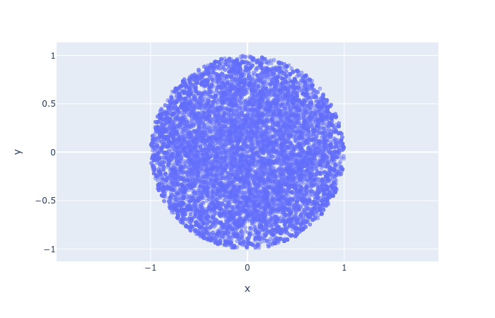
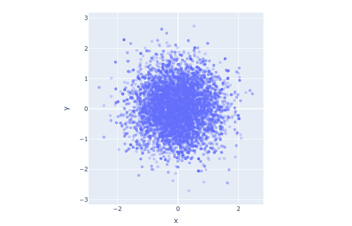
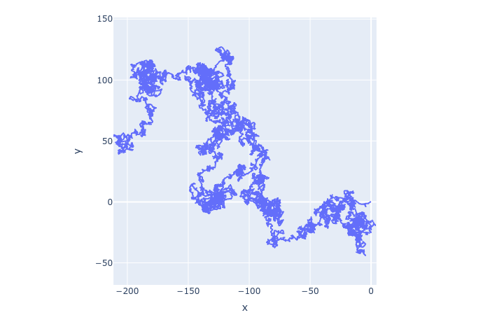
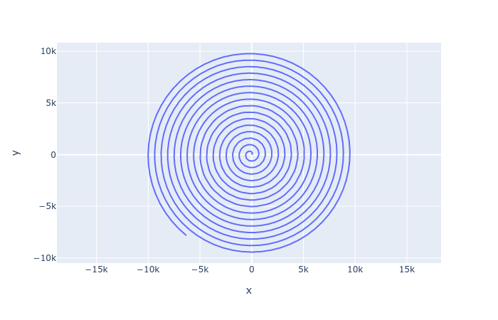

# EasyMH: Easy Metropolis-Hastings (algorithm)

Metropolis-Hastings is one of the two well-known sampling algorithms (with the other one being Gibbs) for Markov Chain Monte-Carlo (MCMC) estimation methods, which are frequently used in Bayesian statistics, Graphical models, etc..
This lightweight Python package helps you use MCMC based on Metropolis-Hastings sampling to solve your own problems in research or engineering.

## Why another package?
There are already several powerful Python packages in this direction, one may raise the question why I bother to build another one.
While those full-fledged packages are powerful, I see their strength as their own weakness.
For instance, when you are in the climax of solving your research problem and you just need a single function (just like the `minimize` in Scipy) to score the goal.
At this exciting moment where you are only one step away from your Goddess, you find yourself having to calm down and consult a one hundred page manual to find the correct way to use a package.
Oh, shit...

With this package, everything becomes easy.
You no longer need to climb the steep learning curve like reading a medical notice or a law contract.
With merely one line of code, the famous Metropolis-Hastings algorithm is within your hand.
While your peers are sweating about the error messages of a complex package, you have already solved your problem and moved on.
All these advantages are brought to you by this package.

## Features
- **One-liner**: It requires only one line of code to plug a MCMC method in your program.
- **Purity**: Everything is written in Python and open-source. There is no hidden secret.
- **In-cube sampling**: The sampling domain does not need to be the whole space. It can also be an open cube, bounded or not. For closed cubes, just add epsilons to the cube.
- **Flexibility**: Within each iteration, you can sample dimension by dimension or sample once for all dimensions. Or you can sample a single dimension during each iteration in a rotative fashion. The inner sampling distribution can be either Gaussian or uniform.
- **State-variant**: Your sampling strategy can depend not only on the time but also on the state.
- **God Space**: The current space may not be an ideal place to apply MCMC, and some "God Space" may be a better choice. By applying a parameter transformation, you ascend to the God Space, and descend to the current space later.
- **Track slicer**: You can choose the indices on which to compute your final estimate. It not only gives you the way to specify the burn-in period but also allows you to pick a sub series.
- **Reducer**: You do not have to use the mean function to obtain the final estimate. You can also use median or any other reducer, built-in or not.
- **Customizability**: You can supply your own `move` function and/or `law` function to customize the behavior of the algorithm, in essentially the same way as when you use the map-reduce frameworks.

## Creative examples

## Documentations
Star this repository to encourage me to overcome my procrastination.
